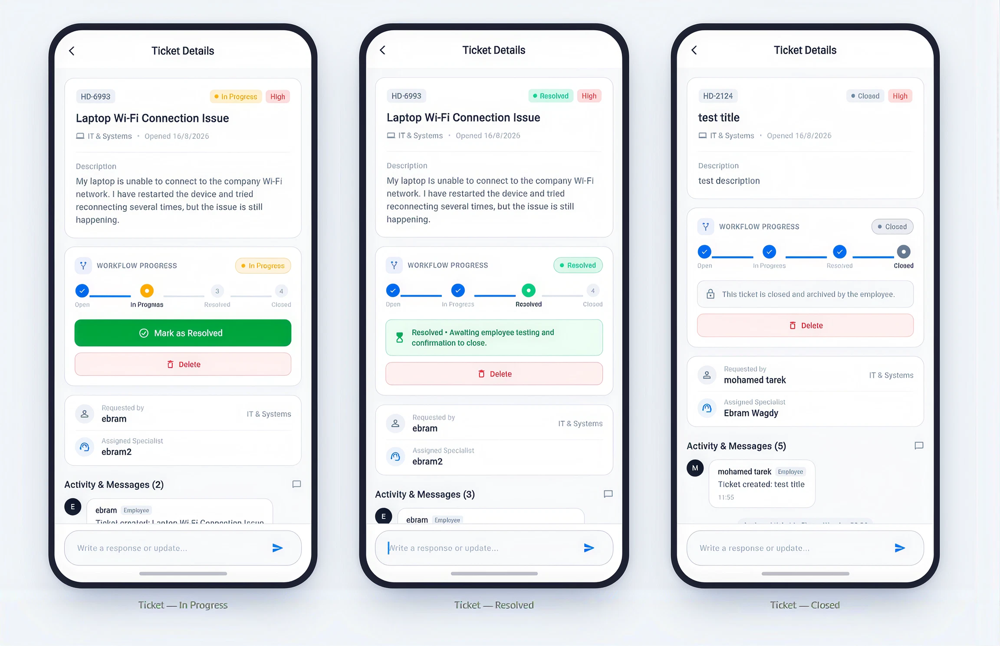
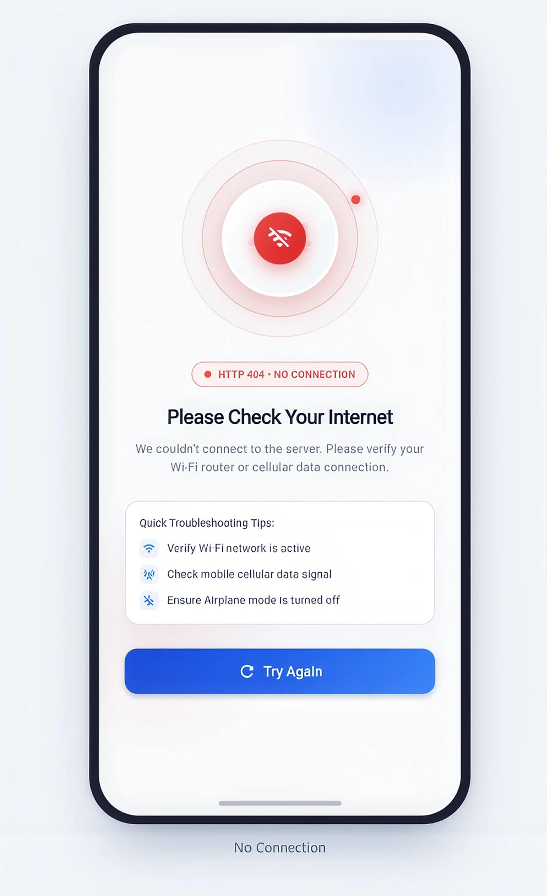

<p align="center">
  
</p>

<h1 align="center">🎫 HelpDesk Lite — Internal Support Ticketing Workspace</h1>

<p align="center">
  <a href="https://betadrop.app/install/HTuPxW"></a>
  <a href="https://flutter.dev/"></a>
  <a href="https://dart.dev/"></a>
  <a href="https://firebase.google.com/"></a>
  <a href="https://bloclibrary.dev/"></a>
  <a href="LICENSE"></a>
</p>

> A modern, lightweight, role-based internal helpdesk workspace engineered to streamline support requests, eliminate duplicate communications, ensure task accountability, and provide management with real-time operational visibility.

📲 **Live Demo / Install APK:** [Download & Install via BetaDrop](https://betadrop.app/install/HTuPxW)

---

## 📱 App Previews & Screenshots

### 📊 Manager Executive Analytics & KPIs
<p align="center">
  
</p>

### 💬 Ticket Details & Timeline
<p align="center">
  
</p>

### 🎧 Support Agent Workspace
<p align="center">
  
</p>

### 🌐 Network Connectivity Check
<p align="center">
  
</p>

---

## 📌 Table of Contents

- [Overview](#-overview)
- [App Previews & Screenshots](#-app-previews--screenshots)
- [Key Features by Role](#-key-features-by-role)
  - [👤 Employee Portal](#-employee-portal)
  - [🎧 Support Agent Workspace](#-support-agent-workspace)
  - [📊 Manager Executive Dashboard](#-manager-executive-dashboard)
- [Tech Stack & Architecture](#-tech-stack--architecture)
- [Project Structure](#-project-structure)
- [Getting Started](#-getting-started)
  - [Prerequisites](#prerequisites)
  - [Installation & Setup](#installation--setup)
  - [Firebase Configuration](#firebase-configuration)
- [Security & Database Rules](#-security--database-rules)
- [Roadmap](#-roadmap)
- [License](#-license)

---

## 🚀 Overview

In modern workplaces, support requests often get scattered across emails, chat channels, and informal conversations. This leads to lost requests, ambiguous ownership, delayed follow-ups, and a lack of executive visibility.

**HelpDesk Lite** centralizes all internal requests (IT, HR, Facilities, Operations, Finance) into a unified, transparent, and structured ticketing pipeline.

### Core Objectives:
* **Centralization**: One single portal for all internal operational support.
* **Accountability**: Every ticket has clear ownership, priority, and progress tracking.
* **Visibility**: Real-time workload metrics and status visibility for all stakeholders.
* **Simplicity**: Fast, intuitive, and clean user experience with minimal cognitive overhead.

---

## 🌟 Key Features by Role & Engine

### 🔑 Authentication & Access Control
* **Google Authentication (Google Sign-In)**: Fast, frictionless one-tap sign-in with Google account, automatically populating and caching user profiles.
* **Email & Password Authentication**: Secure registration and login with fortified RFC-compliant validation and regex sanitization.
* **Role-Based Access Control (RBAC)**: Strict permission boundaries for `Employee`, `Support Agent`, and `Manager` roles.

### ⏱️ SLA Management & Auto-Escalation Engine
* **Target Deadlines by Priority**:
  * 🔴 **Urgent**: 4 hours
  * 🟠 **High**: 12 hours
  * 🟡 **Medium**: 24 hours
  * 🟢 **Low**: 48 hours
* **Active Ticket SLA Monitoring**: Dynamic countdown timers, progress bars, and status badges (`On Track`, `Warning`, `Breached`, `SLA Met`) exclusively tracked on active open tickets.
* **Automated Priority Escalation**: Overdue `Medium` tickets automatically escalate to `High` after 24 hours with automated system audit log notes.
* **Intelligent Priority Sorting**: Active tickets are sorted by urgency (`Urgent` ➔ `High` ➔ `Medium` ➔ `Low`), followed by newest submission date.

### 👤 Employee Portal
* **Intuitive Ticket Creation**: Submit support requests with title, description, category, priority, and attachments.
* **File & Image Attachments**: Attach photos, error screenshots, and documents directly to tickets.
* **Real-time Status Tracking**: Monitor ticket progress through stages: `Open` ➔ `In Progress` ➔ `Resolved` ➔ `Closed`.
* **Collaborative Timeline & Comments**: Real-time communication and updates directly within the ticket detail view.
* **Personal Request Hub**: Easily filter, search, and manage submitted requests.

### 🎧 Support Agent Workspace
* **Triage & Department Matching**: Filter tickets by department (`IT`, `HR`, `Facilities`, `Operations`, `Finance`).
* **Ticket Assignment & Ownership**: Claim unassigned tickets or assign them across the verified support team.
* **Status Lifecycle Management**: Transition tickets seamlessly with resolution notes and timestamps.
* **Audit & History Logs**: Full visibility into ticket updates, status changes, and collaborator interactions.

### 📊 Manager Executive Dashboard
* **Workload & Queue Analytics**: Interactive charts and breakdown of active vs. resolved tickets powered by Syncfusion.
* **SLA Health & Breach Metrics**: Real-time SLA compliance tracking (%) and breach counts across open workloads.
* **Department Performance**: High-level visibility into team workloads, departmental distribution, and pending bottlenecks.
* **User & Agent Verification**: Manage permissions and oversee agent assignments.

---

## 🧪 Comprehensive Automated Testing & Security

HelpDesk Lite includes a robust automated testing suite with **38 test suites** covering all critical business flows:

* **SLA & Escalation Engine Tests**: Validates SLA deadline computations, breach calculations, and auto-escalation triggers.
* **Security & Input Sanitization Tests**: Fortified against XSS, injection vectors, and malformed inputs.
* **Role & Permissions Verification**: Ensures strict RBAC boundaries and secure fallbacks.
* **Cubit & State Management Tests**: Full coverage for `TicketListCubit`, `TicketDetailsCubit`, and `AuthCubit`.
* **Internationalization & RTL Tests**: Verifies complete bilingual support (`Arabic` and `English`) with correct RTL/LTR directionality.

```bash
# Run all automated unit and integration tests
flutter test

# Run static analysis
flutter analyze
```

---

## 🛠 Tech Stack & Architecture

### Core Technologies
* **Framework**: [Flutter](https://flutter.dev/) (SDK `^3.10.7` / Dart 3.x)
* **Design System**: Material 3 Design with custom typography, bilingual RTL/LTR support, gradients, and dark/light themes
* **State Management**: [flutter_bloc](https://pub.dev/packages/flutter_bloc) (BLoC / Cubit Pattern)
* **Dependency Injection**: [get_it](https://pub.dev/packages/get_it) (Service Locator)
* **Connectivity & Network Check**: [connectivity_plus](https://pub.dev/packages/connectivity_plus) (Live connection monitoring & 404 handler)
* **Routing**: [go_router](https://pub.dev/packages/go_router) (Declarative deep-linking)
* **Backend & Cloud**:
  * **Authentication**: [firebase_auth](https://pub.dev/packages/firebase_auth) & [google_sign_in](https://pub.dev/packages/google_sign_in) (Google Auth + Email/Password)
  * **Database**: [cloud_firestore](https://pub.dev/packages/cloud_firestore) (Real-time NoSQL storage)
  * **Storage**: [firebase_storage](https://pub.dev/packages/firebase_storage) (Secure media and attachment uploads)
* **Visualization & UI Components**:
  * [syncfusion_flutter_charts](https://pub.dev/packages/syncfusion_flutter_charts) for executive data visualization
  * [font_awesome_flutter](https://pub.dev/packages/font_awesome_flutter) for branded vector icons
  * [lottie](https://pub.dev/packages/lottie) & [flutter_svg](https://pub.dev/packages/flutter_svg) for animations and vector assets
  * [qr_flutter](https://pub.dev/packages/qr_flutter) for ticket QR codes and quick sharing
  * [image_picker](https://pub.dev/packages/image_picker) for ticket attachment uploads

### Architectural Pattern
HelpDesk Lite utilizes a **Feature-First / Clean Architecture** pattern:
```text
lib/
├── app/                  # Application root & app-level configurations
├── core/                 # Shared domain logic, services, routing, and theme
│   ├── database/         # Local / remote database helpers
│   ├── errors/           # Failures, exceptions, and global error handling
│   ├── routing/          # GoRouter definitions & route guards
│   ├── services/         # Connectivity service, Firebase service, Storage, Service Locator
│   ├── theme/            # Color palettes, typography, and themes
│   ├── utils/            # Constants, date formatters, and validators
│   └── widgets/          # Reusable UI components, 404 No Internet widget, buttons
└── features/             # Business modules grouped by domain
    ├── agent_dashboard/  # Agent queue management & ticket triage
    ├── auth/             # Authentication (Login, Sign-up, User models)
    ├── employee_portal/  # Employee portal & personal ticket list
    ├── manager_dashboard/# Manager metrics, charts & executive overview
    ├── profile/          # User settings & profile management
    ├── splash/           # Splash screen & initial auth routing
    └── tickets/          # Ticket creation, details, comments, and state cubits
```

---

## 📂 Project Structure

```bash
helpdesk/
├── assets/
│   ├── images/              # App branding (logo.png, 1.png, 2.png, 3.png, 4.png)
│   ├── lottie/              # Lottie animation files
│   └── svgs/                # Vector SVG icons
├── lib/
│   ├── app/
│   ├── core/
│   │   ├── database/
│   │   ├── errors/
│   │   ├── routing/
│   │   ├── services/
│   │   ├── theme/
│   │   ├── utils/
│   │   └── widgets/
│   ├── features/
│   │   ├── agent_dashboard/
│   │   ├── auth/
│   │   ├── employee_portal/
│   │   ├── manager_dashboard/
│   │   ├── profile/
│   │   ├── splash/
│   │   └── tickets/
│   ├── firebase_options.dart
│   └── main.dart
├── firestore.rules          # Firestore security rules
├── storage.rules            # Cloud Storage security rules
├── pubspec.yaml             # Project dependencies and asset definitions
└── README.md
```

---

## ⚡ Getting Started

### Prerequisites
* [Flutter SDK](https://docs.flutter.dev/get-started/install) (version `>=3.10.7`)
* [Dart SDK](https://dart.dev/get-dart)
* [Firebase CLI](https://firebase.google.com/docs/cli) installed and configured
* Android Studio / Xcode / VS Code with Flutter extension

### Installation & Setup

1. **Clone the repository**:
   ```bash
   git clone https://github.com/EbramWagdy1/Helpdesk-Lite.git
   cd Helpdesk-Lite
   ```

2. **Install Flutter dependencies**:
   ```bash
   flutter pub get
   ```

3. **Configure Firebase**:
   * Ensure your Firebase project is set up on the [Firebase Console](https://console.firebase.google.com/).
   * Run FlutterFire CLI to configure platform credentials:
     ```bash
     flutterfire configure
     ```

4. **Run the Application**:
   ```bash
   # Run on connected device / emulator
   flutter run
   ```

---

## 🔒 Security & Database Rules

The project includes pre-configured security rules for both Firestore and Firebase Storage:

* **Firestore Security (`firestore.rules`)**:
  * Authenticated access required for ticket creation and comments.
  * Role-based checks ensuring only assigned agents and managers can modify ticket assignment and resolution states.
* **Storage Security (`storage.rules`)**:
  * Secure uploads for ticket attachments restricted to authenticated users.

Deploy rules using the Firebase CLI:
```bash
firebase deploy --only firestore:rules,storage:rules
```

---

## 🗺 Roadmap

- [x] Role-Based Authentication (`Employee`, `Agent`, `Manager`)
- [x] Google Authentication (One-tap Google Sign-In & Profile Sync)
- [x] Priority-Based SLA Management & Auto-Escalation Engine
- [x] Ticket Creation with attachments and priority tagging
- [x] Departmental triage (`IT`, `HR`, `Facilities`, `Finance`, `Operations`)
- [x] Interactive Comments & Status Timeline
- [x] Manager Executive Analytics with visual chart summaries
- [x] Comprehensive Automated Test Suite (Unit, RBAC, SLA & Security)
- [x] Connectivity Monitoring with 404 No Internet Screen
- [x] Centralized App-Wide Error Handling System
- [ ] Push Notifications for ticket status updates (FCM)
- [ ] Offline caching & sync
- [ ] Automated email-to-ticket ingestion (V2)
- [ ] Multi-tenant organization support (V2)

---

## 📄 License

**Copyright (c) 2026 Ebram Wagdy Samy Zaki**

**PROPRIETARY SOFTWARE — ALL RIGHTS RESERVED.**

This software and its source code are the exclusive property of Ebram Wagdy Samy Zaki.

No permission is granted to copy, modify, reproduce, distribute, publish, sublicense, sell, or use this software or any part of it for commercial or non-commercial purposes without prior written permission from the copyright holder.

Unauthorized use, reproduction, modification, distribution, or commercial use of this software is strictly prohibited.

The software is provided "AS IS", without warranty of any kind, express or implied.

For licensing or permission requests, please contact **Ebram Wagdy Samy Zaki through GitHub**.
